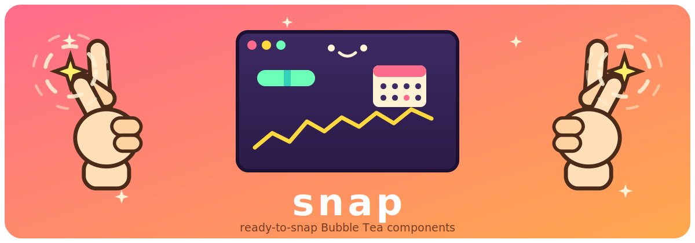
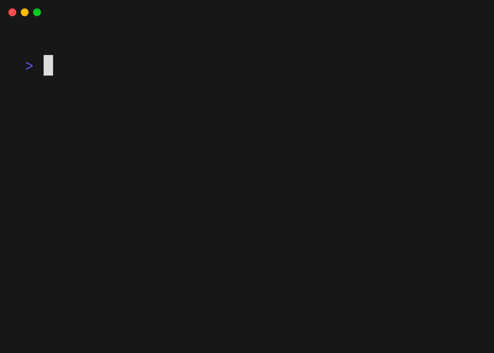
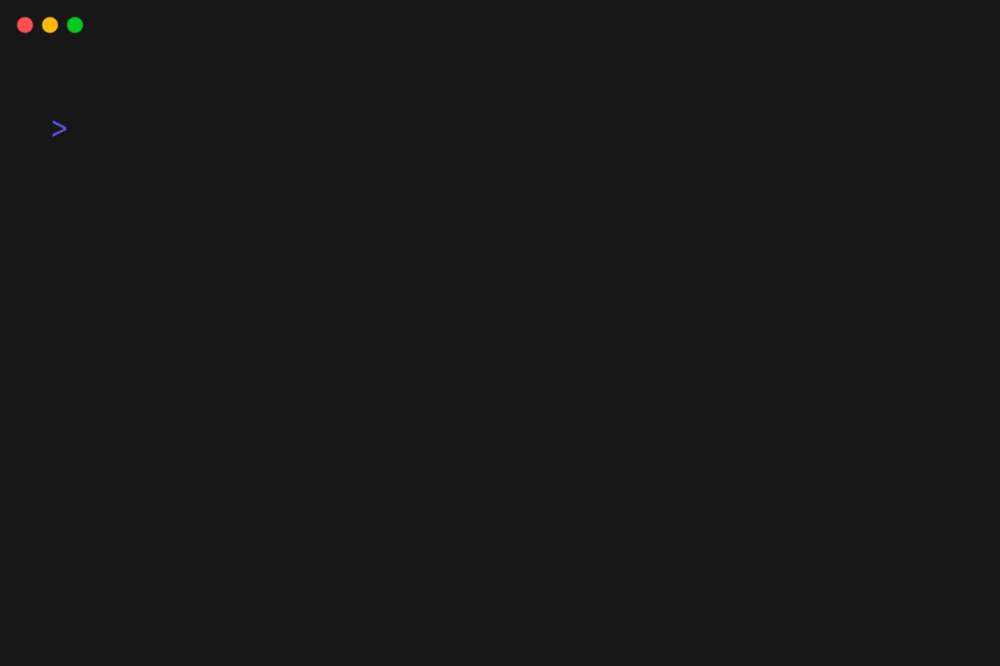
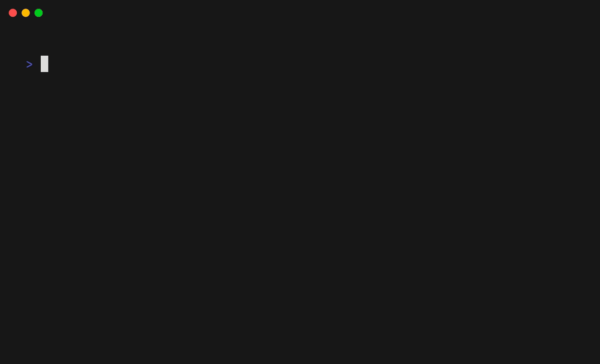
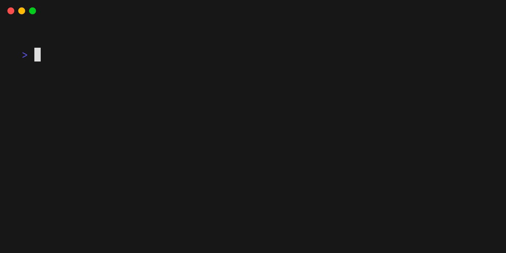
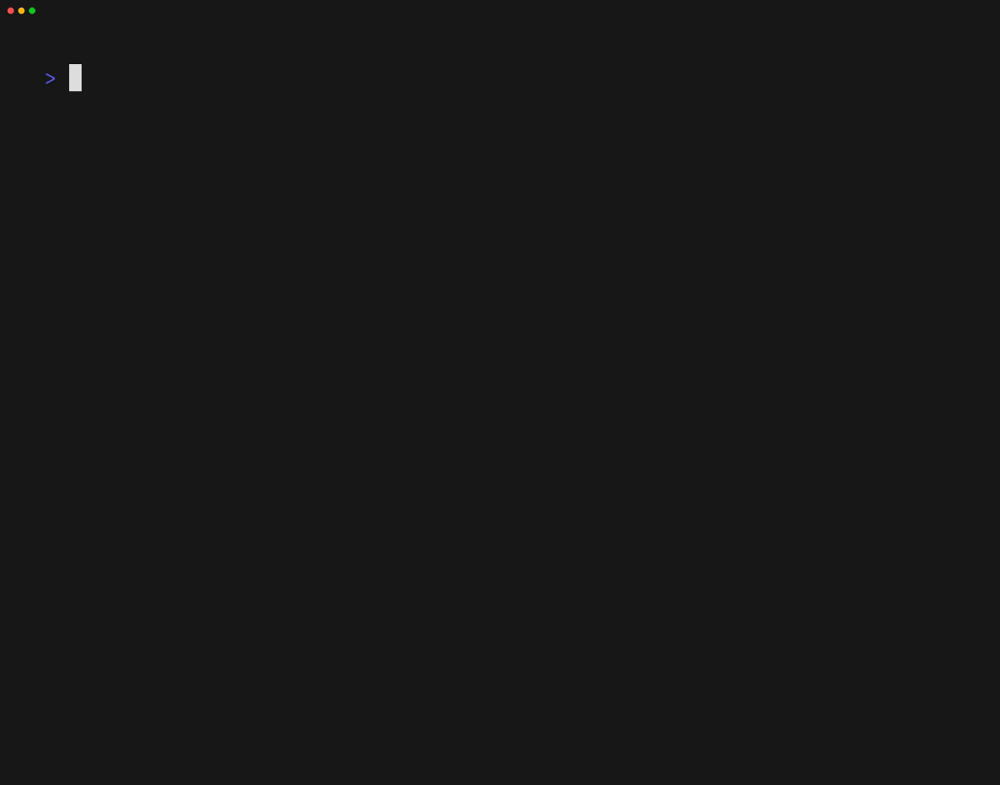
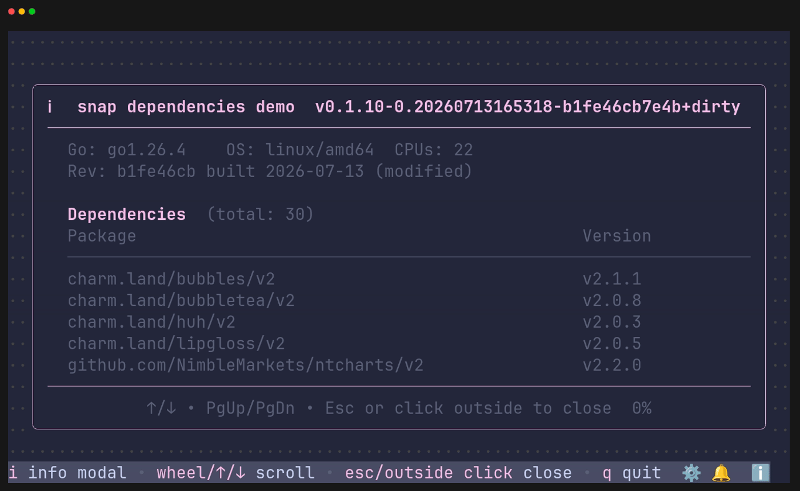
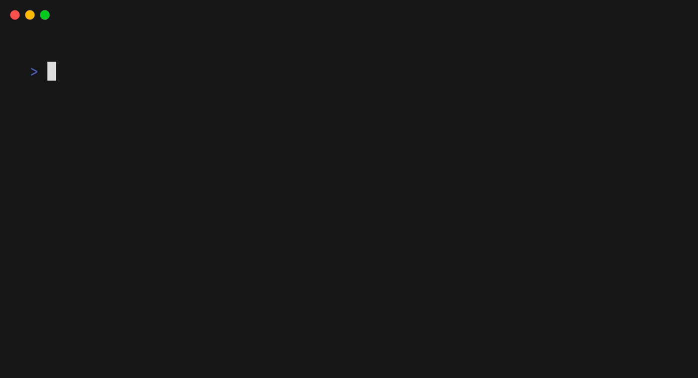
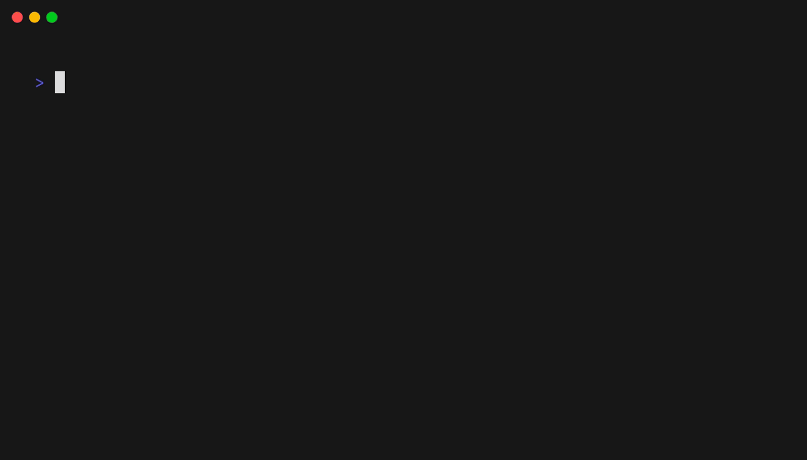

# Snap



**Jarvis Friends Snap** — ready-to-use, production-minded
[Bubble Tea v2](https://github.com/charmbracelet/bubbletea) components
("snaps"): navigation, tables, pickers, calendars, charts, and status
surfaces with first-class keyboard **and** mouse support.

Every snap is theme-free with injected style hooks, so it drops into any
Charm-stack app and adopts that app's look. Where a snap has multiple
implementations (navigation styles, scrollbar presets, pill shapes), it
exposes the choice through a small interface or preset list an app can
surface to its users at runtime.

## Components and gallery

Every demo below lives in `examples/` and is a VHS tape rendered in the
official vhs container. Regenerate them all with
`go -C tools/rendertapes run .` (Docker or Podman; the tool cross-compiles
each example, runs every `*.tape` in parallel, and drops gifs next to tapes).

The examples also work as script-friendly input tools: each one renders its
TUI on stderr and writes only the selected value to stdout, exiting 1 on
cancel.

```bash
date=$(go run ./examples/datepicker)   # -> 2026-07-12
when=$(go run ./examples/timepicker)   # -> 08:30:45
svc=$(go run ./examples/table)         # -> api
```

Every example shows the same snap status bar with key bindings; pass
`--no-help` to hide it.

### Date picker

Calendar date picker with click-to-confirm days, header month/year focus,
and keyboard/wheel paging.



### Time picker

`HH:MM(:SS)` time field with per-column dropdowns, type-ahead, and
validation.



### Charts

Sparklines, horizontal bars, pie, and sankey charts rendered as
ID-routed tea models with stretch-to-fit sizing.


### Line chart

Braille line chart showing rolling streams with compact terminal-cell
rendering.



### Cell canvas

Whole-cell canvas and gradient helpers for animated truecolor effects.


### Pickers

Drive-aware directory picker and related path-editing interactions.



### Context menu

Right-click menu with keyboard parity and terminal-edge clamping.


### Scrollbar

Scrollbar presets with click/drag mapping through `OffsetAt`.


### Table

Sortable/filterable table with row activation and keyboard/mouse support.



### Dependencies modal

Build info and dependency reader rendered through the status info modal.



### Forms helpers

Parser-backed form validation for required fields, durations, ISO dates,
and list splitting.


### Pills and breadcrumbs

Segmented pills, shape variants, and breadcrumb styling helpers from the
shared style contract.



### Navigation

Tabs, Sidebar, and MinimalTopNav behind one navigator contract.



### Status and notifications

Status bar surfaces plus notification toast/history flows.


### Supporting packages (no standalone GIF)

- `gate/`: feature-gate registry with env overrides for settings-exposed flags.
- `geom/`: rect/point geometry helpers for hit-testing and layout math.
- `keys/`: rebindable common key map shared by snaps and apps.
- `layout/`: lipgloss frame arithmetic helpers.
- `logging/`: reserved placeholder.
- `osc/`: OSC 9;4 taskbar/tab progress integration.
- `page/`: shared page base for sizing and colors.
- `rendercheck/`: golden/layout/code-standard test helpers.
- `uifx/`: mouse handlers, named zones, and effect tiers.
- `winterm/`: Windows default-terminal detection and repair helpers.

The three navigation styles live side by side because they satisfy the same
navigator contract; an app can swap between them at runtime.

## Design rules

- **Theme-free with style hooks.** Components take injected styles (the
  datepicker/timepicker pattern) instead of importing an app theme, so any
  Bubble Tea app can adopt them. Hosts map their live theme onto the hooks.
- **Keyboard and mouse.** Every interactive element works keyboard-only,
  mouse-only, and mixed.
- **Settings-ready interfaces.** Where multiple implementations exist (e.g.
  navigation), a snap exposes an interface so an app can offer the choice to
  users at runtime.
- Dependencies stay down to `charm.land/{bubbletea,bubbles,lipgloss}/v2` plus
  small helpers that move with the component. One deliberate exception:
  `charts` plots braille through
  [ntcharts](https://github.com/NimbleMarkets/ntcharts) rather than
  duplicating its canvas — snap only keeps the chart shapes ntcharts lacks.
- Every component folder eventually gets a VHS `.tape` demo and its own README.

## Development

`bash tools/local_verify.sh` is the gate: gofmt, golangci-lint on
windows+linux, shellcheck, markdownlint, go vet, `go test -race`, and a
dependency review (module-level vulnerability scan plus OpenSSF Scorecards
on direct dependencies).

For color-audit passes, force a loud demo background at runtime with
`SNAP_DEMO_DEBUG_BG=#ff0066` before running an example or rendering tapes.
Any unthemed background holes become obvious immediately.

The test suite also runs `rendercheck.CheckCodeStandards` over the whole
module: display text is measured and padded in terminal cells, never bytes.
Concretely — no `len()` on display strings (use `lipgloss.Width`), no
printf width-padding of string verbs like `%-9s` (use
`lipgloss.PlaceHorizontal` / `Style.Width`), no `strings.Join(rows, "\n")`
(use `lipgloss.JoinVertical`), and no space-run gaps concatenated for
alignment (use `PlaceHorizontal` or a `Width`/padded style).

Consumers pin tagged releases; for cross-repo development against an
application, use a `go.work` file locally and keep `replace` directives out
of committed `go.mod` files.

## Input contract (mouse + keyboard)

Every visual snap splits input by concern:

- **`OnMouse` owns the pointer.** Clicks, wheel (all four directions), drag,
  and hover are handled in `View().OnMouse` (dispatched by
  `uifx.MouseHandlers` to the component's handler methods) — never in
  `Update`. Keeping the two paths separate isolates pointer logic from state
  transitions and leaves room to process them independently later.
- **`Update` owns keys and messages.** Component `Update`s contain no
  `tea.MouseMsg` cases; a host that feeds one raw mouse anyway hits dead
  code, not a second handler.
- **Hit zones are named layers, not hand-kept rectangles.** Components build
  `uifx.Zones` from the same `lipgloss.NewLayer(content).ID(name)` blocks the
  frame is composed of, and handlers ask `zones.Hit(x, y)` which zone the
  pointer landed in — powered by lipgloss v2's `Compositor.Hit`, so zones
  track layout changes and resolve overlap by z-order (the timepicker package
  is the reference; the datepicker's uniform grid and the pickers' list rows
  still use direct arithmetic where that is simpler).
- **Parents translate and call the child's `OnMouse`.** Bubble Tea v2 only
  invokes the _root_ view's `OnMouse` (absolute coordinates) and does **not**
  translate for children — a parent adjusts x/y itself and calls the child's
  `View().OnMouse`. Never forward mouse into a child's `Update` — the runtime
  hands the raw event to both the root `OnMouse` _and_ `Update`, so two doors
  means every click processed twice.

### Effect tiers (`uifx.Level`)

| Tier                    | Feedback                                                                       | Root mouse mode |
| ----------------------- | ------------------------------------------------------------------------------ | --------------- |
| `LevelMinimal`          | interactions only — no hover/drag cosmetics, minimal redraw churn (thin links) | `CellMotion`    |
| `LevelMedium` (default) | + wheel everywhere, drag tracking while a button is held                       | `CellMotion`    |
| `LevelHigh`             | + hover highlighting of the element under the pointer                          | `AllMotion`     |

Set a component's `Effects` field and give your root view
`Effects.MouseMode()`. Hover is a motion-event firehose — that is why it is
opt-in.

### Testing input without false failures

Input tests assert **semantic state** (the highlighted day, the focused
column, the cursor row) after events aimed at the component's **own recorded
hit zones** — never hardcoded screen coordinates and never styled output
(styles vary by color profile; where rendering must be checked, an injected
`Transform` marker keeps it profile-independent). That keeps every failure a
real behavior change.
