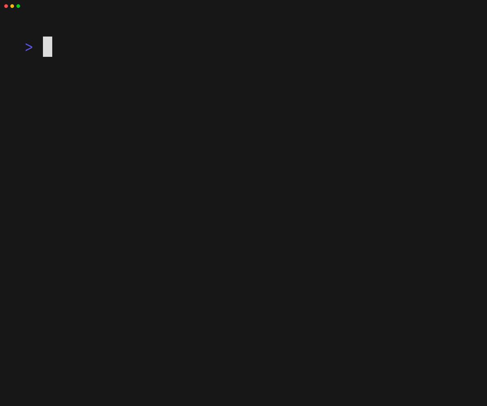
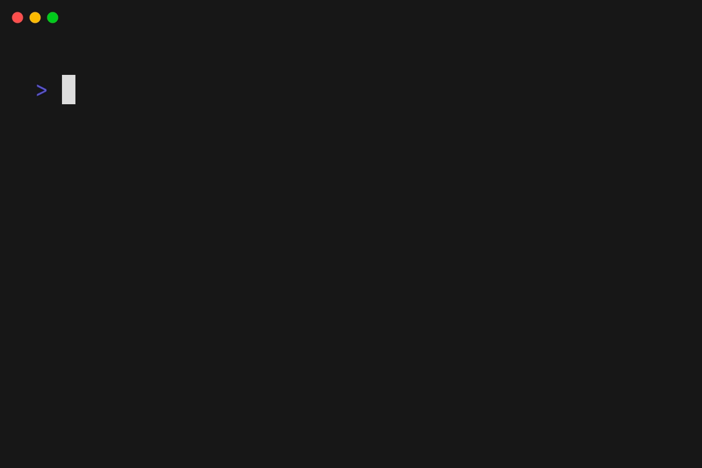

# Snap

**Jarvis Friends Snap** — ready-to-use, production-minded Bubble Tea v2
components ("snaps") extracted from
[tui-base](https://github.com/jarvisfriends/tui-base): navigation, tables,
pickers, and calendar items with first-class keyboard **and** mouse support.

Snap is the single source of truth for these components: tui-base imports them
back rather than redefining them (tui-base ROADMAP Q-20, answered 2026-07-09).
The sibling [inspector](https://github.com/jarvisfriends/inspector) repo holds
the runtime debugger for any Charm-based app.

## Layout

| Folder | Component | Source (tui-base) | Status |
|---|---|---|---|
| `keys/` | Common key-binding map shared by snaps and apps | `keys` | **moved 2026-07-09** |
| `geom/` | Rect/point geometry helpers for hit-testing and layout | `geom` | **moved 2026-07-09** |
| `datepicker/` | Calendar date picker (formerly `bubble-datepicker`) | `datepicker` | **moved 2026-07-09** |
| `timepicker/` | Time picker | `timepicker` | **moved 2026-07-09** — UX redesign tracked in tui-base ROADMAP SP-8 |
| `dependencies/` | Build-info / dependency reader for about views | `common/dependencies.go` | **moved 2026-07-09** |
| `table/` | Data table with selection + scrolling | `table` | **moved 2026-07-10** (wholesale wave) |
| `navigation/` | Tabs, Sidebar, and minimal-top navigators (one package; per-style folders tracked in tui-base SP-5) | `navigation` | **moved 2026-07-10** (wholesale wave) |
| `pickers/` | Drive-aware DirPicker + MultiFileEditor (multi-path rows, per-row pickers) | `pages/settings` | **moved 2026-07-09** — style hooks + huh-theme/collapse-path injection |
| `logging/` | UI-bound logger with subscriber fan-out | `logging` | placeholder — shape depends on the zap decision (tui-base SP-10) |
| `status/` | Status bar with segments, info modal, notification surfaces | `status` | **moved 2026-07-10** (wholesale wave) |
| `notifications/` | Notification manager: severity, TTL, actions, persistence | `notifications` | **moved 2026-07-10** (wholesale wave) |
| `page/` | Shared page base (sizing + colors) for full-page components | `page` | **moved 2026-07-10** (wholesale wave) |
| `styles/` | The shared style contract: semantic AppStyle palette, derived lipgloss styles, bubbletint mapping, presets, YAML themes | `theme` | **moved 2026-07-10** (wholesale wave) — tui-base's theme package is now aliases over this |
| `charts/` | Sparklines, bars, pie/sankey, braille line charts + Canvas; each also wrapped as a tea model with ID-routed data messages and stretch-to-fill sizing (see examples/charts) | dash `creator` | **moved 2026-07-10** (wholesale wave); models added 2026-07-10 |
| `scrollbar/` | Vertical scrollbar column + offset clamping | tribble console `ui/scrollbar.go` | **ported 2026-07-10** (repo sweep) |
| `menu/` | Right-click context menu (mouse + keyboard, terminal-clamped) | tribble console `ui/context_menu.go` | **ported 2026-07-10** (repo sweep) |
| `osc/` | Taskbar/tab progress via OSC 9;4 (WT, ConEmu, iTerm2) | aSettings `pages/ui/osc.go` | **ported 2026-07-10** (repo sweep) — extended with error/paused/determinate states |

The three navigation styles live side by side because they satisfy the same
navigator contract; an app can swap between them at runtime.

## Gallery

Every demo below is a VHS tape rendered in the official vhs container —
regenerate them all with `go -C tools/rendertapes run .` (Docker or Podman;
the tool cross-compiles each example, runs every `*.tape` in parallel, and
drops the gifs next to their tapes).

### Date picker

Calendar with click-to-highlight / click-again-to-confirm days, header
month/year focus, and paging: PgUp/PgDn months, Shift+PgUp/PgDn years, the
wheel over the title pages the unit under the pointer.

### Time picker

Two (or three, with `ShowSeconds`) colon-separated columns editing a
`time.Time`'s clock: digits type ahead, Space/click opens a value dropdown,
the wheel spins the focused column and hops columns horizontally.

### Charts

The chart models live-streaming ID-routed data: two sparklines, a braille
pie (thin slices fold into "Other" with a legend), a sankey, and an hbar,
all stretching into the space the window split gives them.

### Pickers

Drive-aware directory picker: keyboard and wheel walk the tree (wheel left
= parent, right = open), Space selects, Ctrl+S picks the browsed folder.

### Context menu

Right-click (or keyboard) pop-up menu at the pointer: disabled items are
skipped, hover and wheel move the cursor, clicking outside dismisses,
edges clamp to the terminal.

### Scrollbar

The three presets over one scrolling pane — Smooth (sub-cell eighth-block
glide), Line (thin default), Classic (retro blocks).

### Table

Sortable, filterable data table: header clicks sort, `/` filters, Enter or
double-click opens a row, wheel scrolls the selection.

## Design rules

- **Theme-free with style hooks.** Components take injected styles (the
  datepicker/timepicker pattern) instead of importing an app theme, so any
  Bubble Tea app can adopt them. tui-base maps its live theme onto the hooks.
- **Keyboard and mouse.** Every interactive element works keyboard-only,
  mouse-only, and mixed.
- **Settings-ready interfaces.** Where multiple implementations exist (e.g.
  navigation), a snap exposes an interface so an app can offer the choice to
  users at runtime (tui-base surfaces this in its settings page).
- Dependencies stay down to `charm.land/{bubbletea,bubbles,lipgloss}/v2` plus
  small helpers that move with the component.
- Every component folder eventually gets a VHS `.tape` demo and its own README.

## Development

`bash tools/local_verify.sh` is the gate (same as every other repo: gofmt,
golangci-lint on windows+linux, shellcheck, markdownlint, go vet,
`go test -race`).

Cross-repo development against tui-base uses a `go.work` file (see tui-base's
go.work recipe in `docs/migration-from-bubbletea.md`); tui-base's `go.mod` only
ever references tagged snap releases.

## Input contract (mouse + keyboard)

Every visual snap splits input by concern:

- **`OnMouse` owns the pointer.** Clicks, wheel (all four directions), drag,
  and hover are handled in `View().OnMouse` (dispatched by
  `uifx.MouseHandlers` to the component's handler methods) — never in
  `Update`. Keeping the two paths separate isolates pointer logic from state
  transitions and leaves room to process them independently later.
- **`Update` owns keys and messages.** Component `Update`s contain no
  `tea.MouseMsg` cases; a host that feeds one raw mouse anyway hits dead
  code, not a second handler.
- **Hit zones are named layers, not hand-kept rectangles.** Components build
  `uifx.Zones` from the same `lipgloss.NewLayer(content).ID(name)` blocks the
  frame is composed of, and handlers ask `zones.Hit(x, y)` which zone the
  pointer landed in — powered by lipgloss v2's `Compositor.Hit`, so zones
  track layout changes and resolve overlap by z-order (the timepicker package
  is the reference; the datepicker's uniform grid and the pickers' list rows
  still use direct arithmetic where that is simpler).
- **Parents translate and call the child's `OnMouse`.** Bubble Tea v2 only
  invokes the *root* view's `OnMouse` (absolute coordinates) and does **not**
  translate for children — a parent adjusts x/y itself and calls the child's
  `View().OnMouse` (tui-base's overlay `ForwardMouse` is the reference
  implementation). Never forward mouse into a child's `Update` — the runtime
  hands the raw event to both the root `OnMouse` *and* `Update`, so two doors
  means every click processed twice.

### Effect tiers (`uifx.Level`)

| Tier | Feedback | Root mouse mode |
|---|---|---|
| `LevelMinimal` | interactions only — no hover/drag cosmetics, minimal redraw churn (thin links) | `CellMotion` |
| `LevelMedium` (default) | + wheel everywhere, drag tracking while a button is held | `CellMotion` |
| `LevelHigh` | + hover highlighting of the element under the pointer | `AllMotion` |

Set a component's `Effects` field and give your root view
`Effects.MouseMode()`. Hover is a motion-event firehose — that is why it is
opt-in.

### Testing input without false failures

Input tests assert **semantic state** (the highlighted day, the focused
column, the cursor row) after events aimed at the component's **own recorded
hit zones** — never hardcoded screen coordinates and never styled output
(styles vary by color profile; where rendering must be checked, an injected
`Transform` marker keeps it profile-independent). That keeps every failure a
real behavior change.
